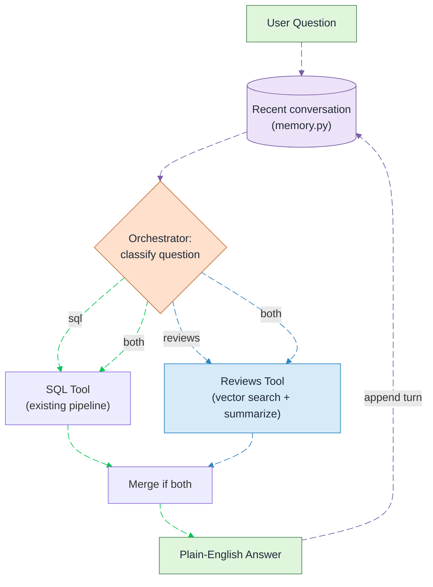
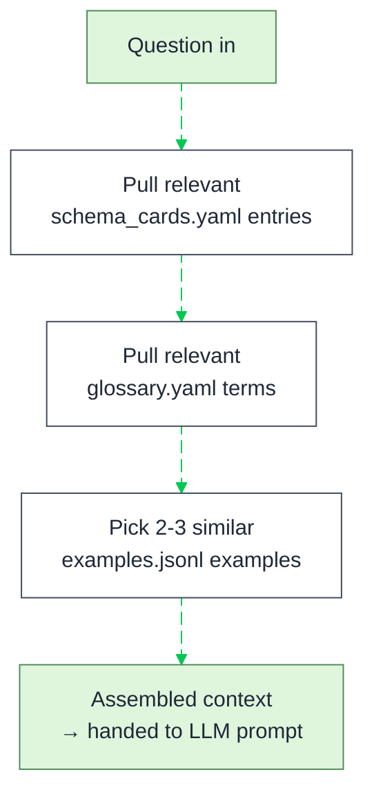
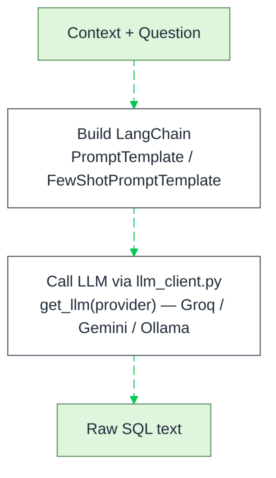
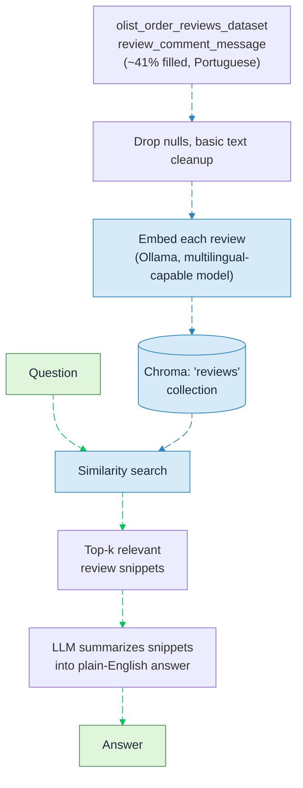
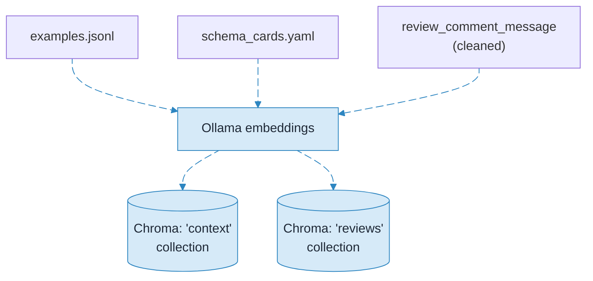
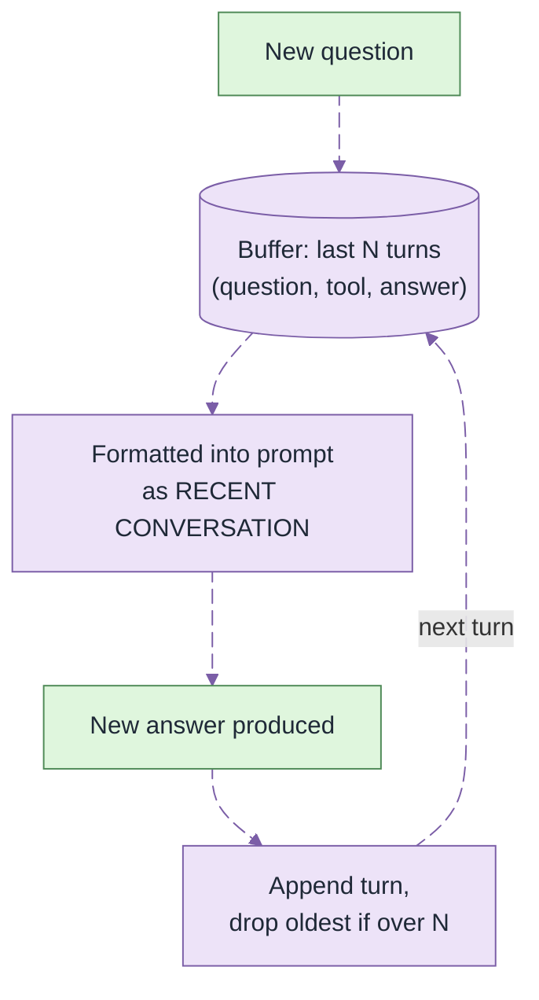
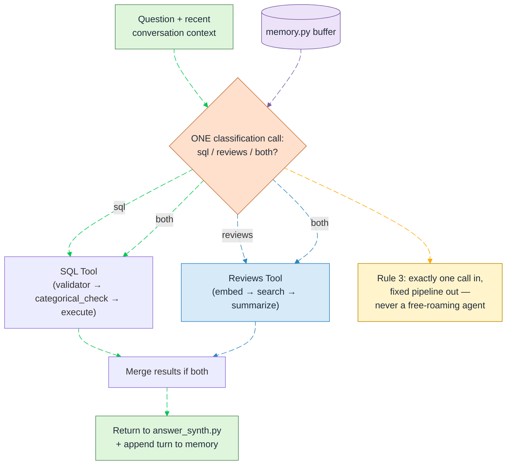
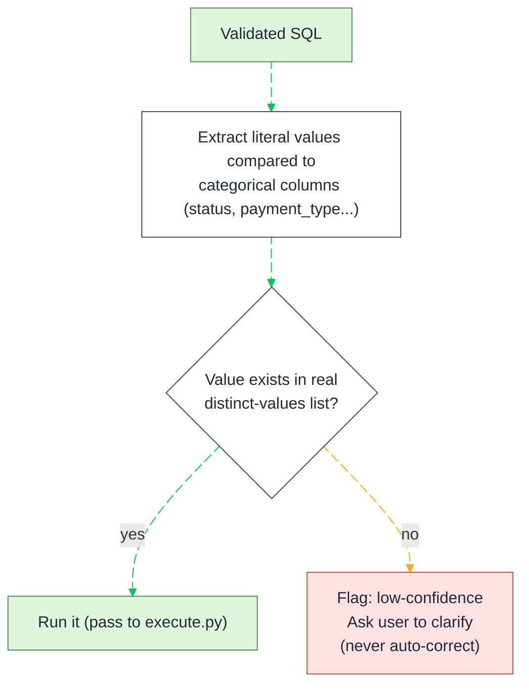
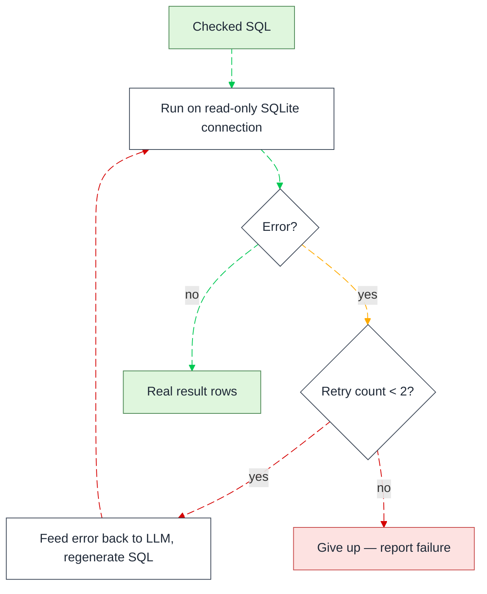

# Flowcharts — Mermaid Source

Same flowcharts as in the Word doc, in raw Mermaid syntax, for pasting into
Obsidian (or any Mermaid-compatible tool). Word can't render Mermaid natively,
so the `.docx` uses rendered images of these same diagrams — this file is the
editable source.

**Color language.** Every edge is a named, animated link (`@{ animation: slow }`)
so the diagrams read like a moving current, not a static wiring chart. Edge
color always means the same thing across every diagram:

| Edge color | Meaning |
|---|---|
| 🟢 Green `#00C853` | normal forward flow — this step succeeded, moving on |
| 🔴 Red `#D50000` | error / retry / refuse / give-up — something failed |
| 🟠 Amber `#FFAB00` | caution — flagged, low-confidence, needs clarification (not a hard failure) |
| 🟣 Lavender `#7B5EA7` | conversation memory — read, write, or append to the recent-turns buffer |
| 🔵 Blue `#2E86C1` | vector / retrieval — embeddings, similarity search, the reviews tool |
| 🟧 Orange `#C2703D` | orchestrator / routing decision — which tool handles this question |
| 🔵🟣🟦 (bright variants) | reserved for the Provider Factory / Roadmap diagrams, to tell parallel branches or phase groups apart at a glance |

Box colors, unchanged:

| Box class | Fill / Border |
|---|---|
| Normal | `#FFFFFF` / `#3F4A5A` |
| Good | `#DFF6DD` / `#4F8A57` |
| Check | `#FFF4CC` / `#B88A00` |
| Bad | `#FDE2E1` / `#C84C4C` |
| Memory | `#EDE3F8` / `#7B5EA7` |
| Vector | `#D6EAF8` / `#2E86C1` |
| Route | `#FFE0CC` / `#C2703D` |

---

## 1. High-Level Pipeline (agent architecture — memory + routing to SQL or Reviews tool)

---

## 2. Block — Understand the Question

## 3. Block — Generate SQL

## 3b. Block — Provider Factory (llm_client.py)

Three branch colors so it's visually obvious these are alternatives, not a
sequence — they all merge back to the same green "normal flow" once a
provider is picked.

## 3c. Block — Reviews Tool (RAG over real review text)

## 3d. Block — Retrieval Infrastructure (shared, both collections)

## 3e. Block — Conversation Memory

## 3f. Block — Orchestrator (orchestrator.py)

The dispatcher, not an agent. It makes exactly **one** LLM classification
call, then hands off to whichever fixed pipeline(s) it picked — each of
which already has its own validator / categorical check / execute (SQL
Tool) or embed / search / summarize (Reviews Tool) guardrails. The
orchestrator itself never touches the database, never re-decides mid-flight,
and never loops — that's what keeps it a dispatcher and not an autonomous
agent (Rule 3 in PROJECT.md).

## 4. Block — Validator (validator.py)

## 5. Block — Categorical Check (categorical_check.py)

## 6. Block — Execute + Repair (execute.py)

## 7. Block — Answer Synthesis (answer_synth.py)

---

## 8. Complete Pipeline — All Blocks Combined

> **Note on edge order:** Mermaid numbers `linkStyle` indices by the order
> edges appear in the source, *including* edges declared inside subgraphs —
> so `G1 --> G2` and `E1 --> E2` (declared up top, inside `B2`/`B5`) are
> indices `0` and `1`, before the edges declared in the main flow further
> down. If you add or remove an edge in this diagram, recount before editing
> `linkStyle`.

---

## 9. Complete Build Roadmap — All Phases

Color grouped by what each phase is really about — data, safety/testing, LLM
connect, retrieval + memory, routing/reviews, then finishing — so the
roadmap tells its own story at a glance, not just a plain progress bar.

```mermaid
---
config:
  layout: fixed
---
flowchart LR
    P0["Phase 0 <br>Real Data and Database"] L_P0_P1_0@--> P1["Phase 1 <br>Semantic Layer"]
    P1 L_P1_P2_0@--> P2["Phase 2<br>Safety layer"]
    P2 L_P2_P3_0@--> P3["Phase 3<br>Value check"]
    P3 L_P3_P4_0@--> P4["Phase 4<br>Gold Test Set"]
    P4 L_P4_P5_0@--> P5["Phase 5<br>Connect Real LLM"]
    P5 L_P5_P55a_0@--> P55a["Phase<br> 5.5a<br>Retrieval + Memory"]
    P55a L_P55a_P55b_0@--> P55b["Phase<br> 5.5b<br>Reviews Tool + Orchestrator"]
    P55b L_P55b_P6_0@--> P6["Phase 6<br>Full Agent"]
    P6 L_P6_P7_0@--> P7["Phase 7<br>Answer Synthesis"]
    P7 L_P7_P8_0@--> P8["Phase 8<br>Interface"]
    P8 L_P8_P9_0@--> P9["Phase 9<br>Polishing And Completion"]

     P55a:::memory
     P55b:::route
     P9:::good
    classDef good fill:#DFF6DD,stroke:#4F8A57,color:#1F2937
    classDef memory fill:#EDE3F8,stroke:#7B5EA7,color:#1F2937
    classDef route fill:#FFE0CC,stroke:#C2703D,color:#1F2937
    linkStyle 0 stroke:#2979FF,fill:none
    linkStyle 1 stroke:#2979FF,fill:none
    linkStyle 2 stroke:#FFAB00,fill:none
    linkStyle 3 stroke:#FFAB00,fill:none
    linkStyle 4 stroke:#AA00FF,fill:none
    linkStyle 5 stroke:#7B5EA7,fill:none
    linkStyle 6 stroke:#C2703D,fill:none
    linkStyle 7 stroke:#00C853,fill:none
    linkStyle 8 stroke:#00C853,fill:none
    linkStyle 9 stroke:#00C853,fill:none
    linkStyle 10 stroke:#00C853,fill:none

    L_P0_P1_0@{ animation: slow } 
    L_P1_P2_0@{ animation: slow } 
    L_P2_P3_0@{ animation: slow } 
    L_P3_P4_0@{ animation: slow } 
    L_P4_P5_0@{ animation: slow } 
    L_P5_P55a_0@{ animation: slow } 
    L_P55a_P55b_0@{ animation: slow } 
    L_P55b_P6_0@{ animation: slow } 
    L_P6_P7_0@{ animation: slow } 
    L_P7_P8_0@{ animation: slow } 
    L_P8_P9_0@{ animation: slow }
```

