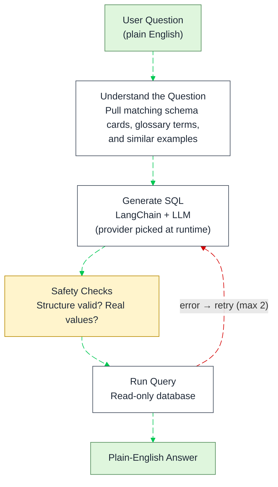
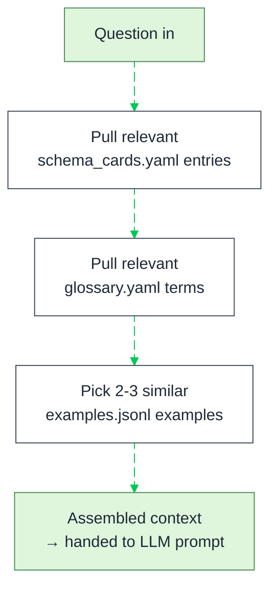
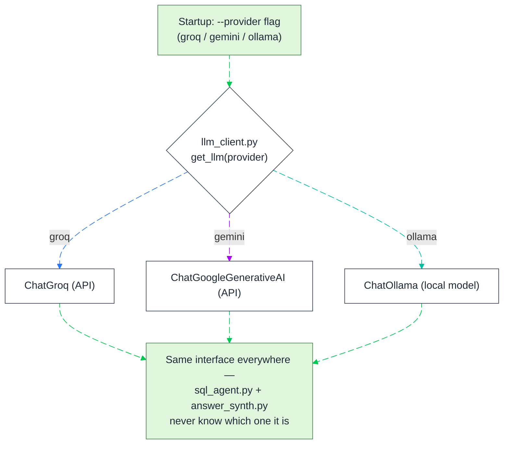
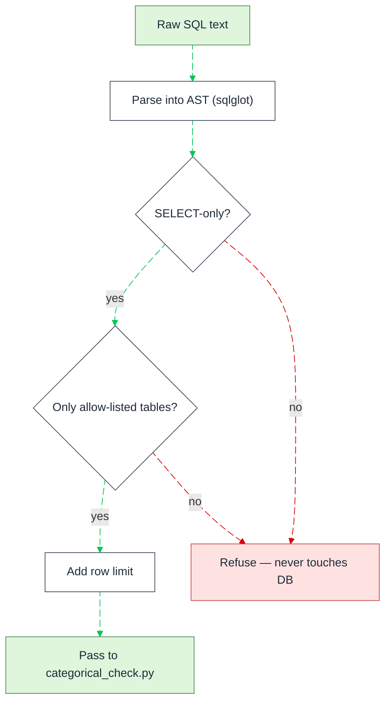
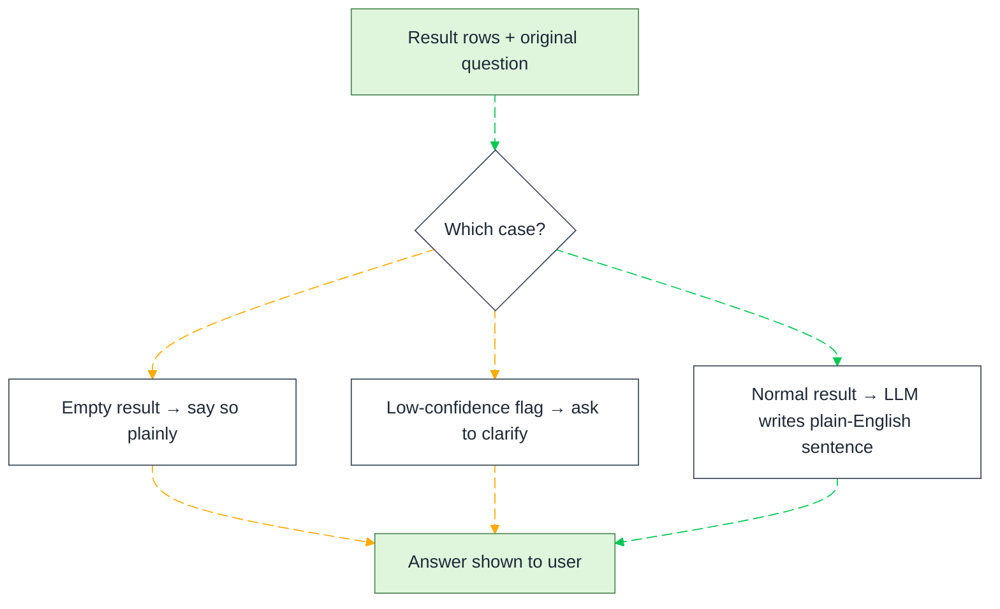
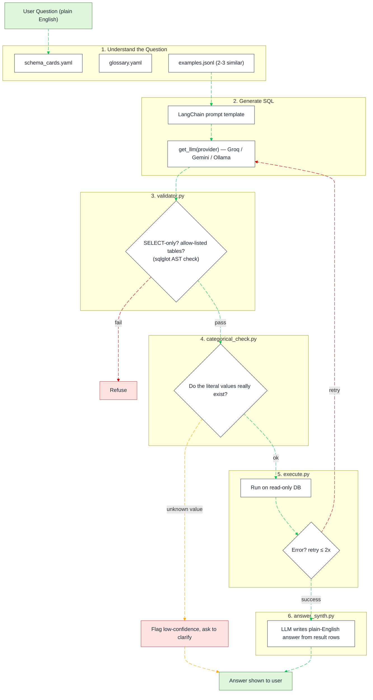

# Flowcharts — Mermaid Source

Same 9 flowcharts as in the Word doc, in raw Mermaid syntax, for pasting into
Obsidian (or any Mermaid-compatible tool). Word can't render Mermaid natively,
so the `.docx` uses rendered images of these same diagrams — this file is the
editable source.

## 1. High-Level Pipeline

---

## 2. Block — Understand the Question

## 3. Block — Generate SQL

## 3b. Block — Provider Factory (llm_client.py)

Three branch colors so it's visually obvious these are alternatives, not a
sequence — they all merge back to the same green "normal flow" once a
provider is picked.

## 4. Block — Validator (validator.py)

## 5. Block — Categorical Check (categorical_check.py)

## 6. Block — Execute + Repair (execute.py)

## 7. Block — Answer Synthesis (answer_synth.py)

---

## 8. Complete Pipeline — All Blocks Combined

> **Note on edge order:** Mermaid numbers `linkStyle` indices by the order
> edges appear in the source, *including* edges declared inside subgraphs —
> so `G1 --> G2` and `E1 --> E2` (declared up top, inside `B2`/`B5`) are
> indices `0` and `1`, before the edges declared in the main flow further
> down. If you add or remove an edge in this diagram, recount before editing
> `linkStyle`.

---

## 9. Complete Build Roadmap — All Phases

Color grouped by what each phase is really about — data, safety/testing, LLM,
then finishing — so the roadmap tells its own story at a glance, not just a
plain progress bar.

```mermaid
flowchart LR
    P0["Phase 0<br/>Real Data & Database"]
    P1["Phase 1<br/>Semantic Layer"]
    P2["Phase 2<br/>Safety Layer"]
    P3["Phase 3<br/>Value Check"]
    P4["Phase 4<br/>Gold Test Set"]
    P5["Phase 5<br/>Connect Real LLM"]
    P6["Phase 6<br/>Full Agent"]
    P7["Phase 7<br/>Answer Synthesis"]
    P8["Phase 8<br/>Interface"]
    P9["Phase 9<br/>Handoff"]:::good

    P0 L_P0_P1_0@--> P1
    P1 L_P1_P2_0@--> P2
    P2 L_P2_P3_0@--> P3
    P3 L_P3_P4_0@--> P4
    P4 L_P4_P5_0@--> P5
    P5 L_P5_P6_0@--> P6
    P6 L_P6_P7_0@--> P7
    P7 L_P7_P8_0@--> P8
    P8 L_P8_P9_0@--> P9

    classDef default fill:#FFFFFF,stroke:#3F4A5A,color:#1F2937
    classDef good fill:#DFF6DD,stroke:#4F8A57,color:#1F2937

    linkStyle 0 stroke:#2979FF,fill:none
    linkStyle 1 stroke:#2979FF,fill:none
    linkStyle 2 stroke:#FFAB00,fill:none
    linkStyle 3 stroke:#FFAB00,fill:none
    linkStyle 4 stroke:#AA00FF,fill:none
    linkStyle 5 stroke:#AA00FF,fill:none
    linkStyle 6 stroke:#00C853,fill:none
    linkStyle 7 stroke:#00C853,fill:none
    linkStyle 8 stroke:#00C853,fill:none

    L_P0_P1_0@{ animation: slow }
    L_P1_P2_0@{ animation: slow }
    L_P2_P3_0@{ animation: slow }
    L_P3_P4_0@{ animation: slow }
    L_P4_P5_0@{ animation: slow }
    L_P5_P6_0@{ animation: slow }
    L_P6_P7_0@{ animation: slow }
    L_P7_P8_0@{ animation: slow }
    L_P8_P9_0@{ animation: slow }
```

