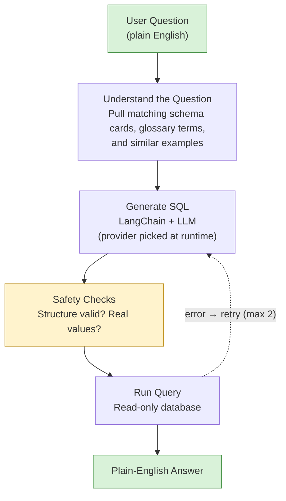
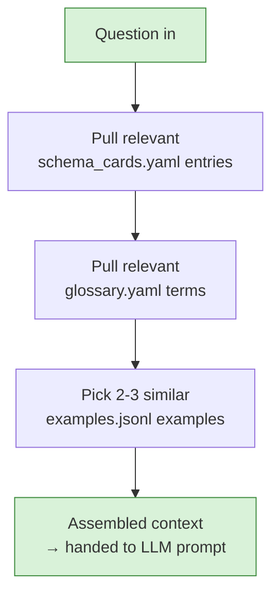
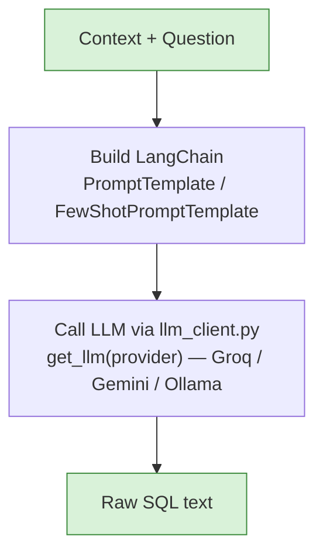
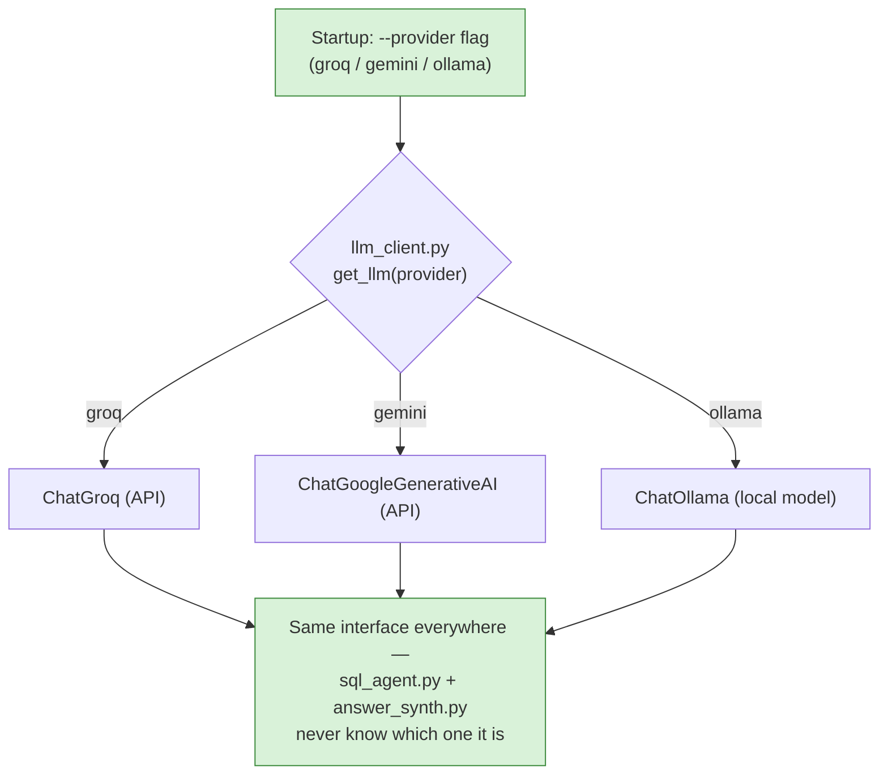
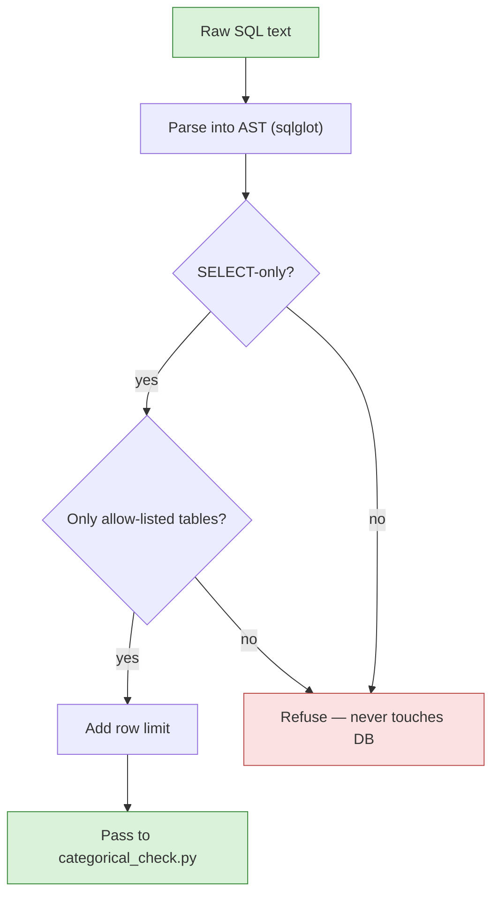
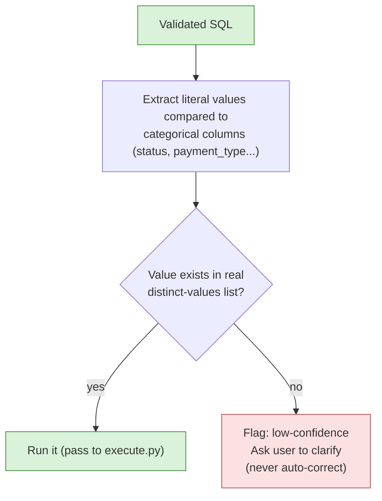
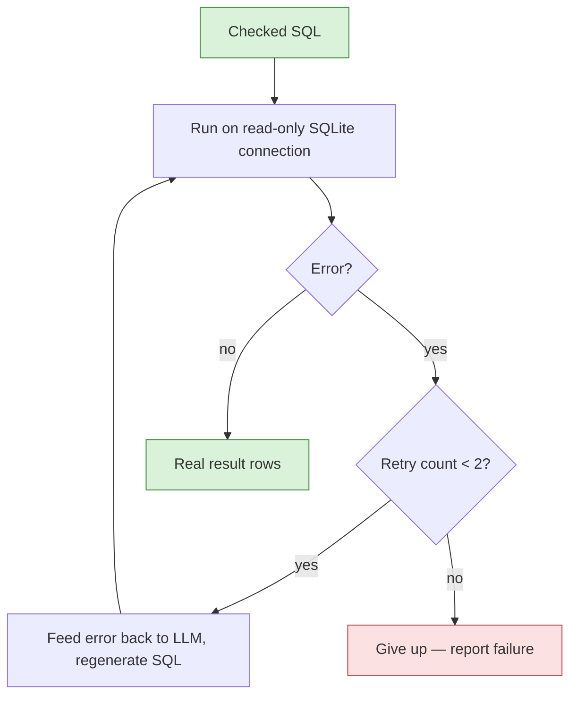
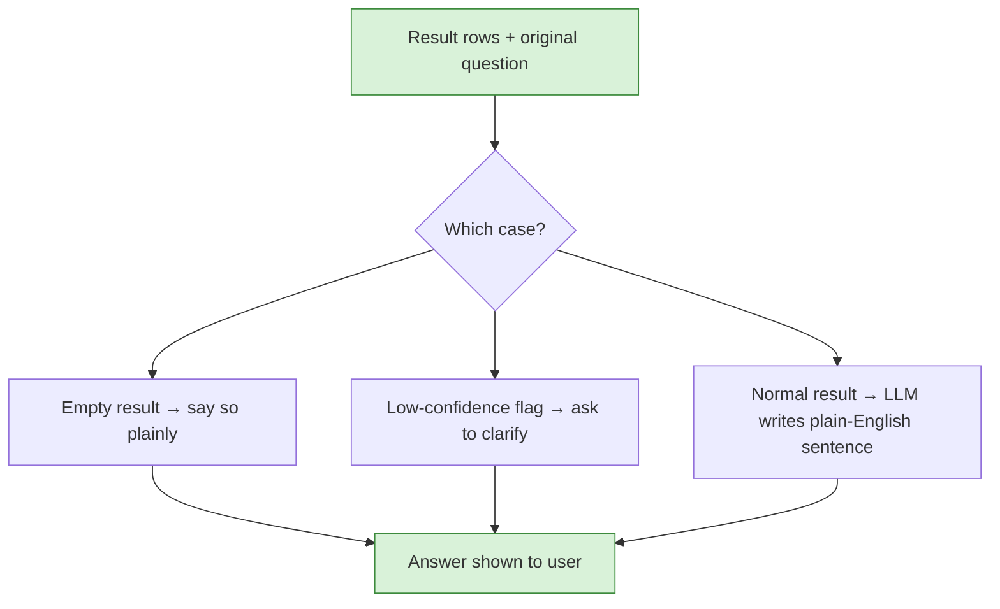
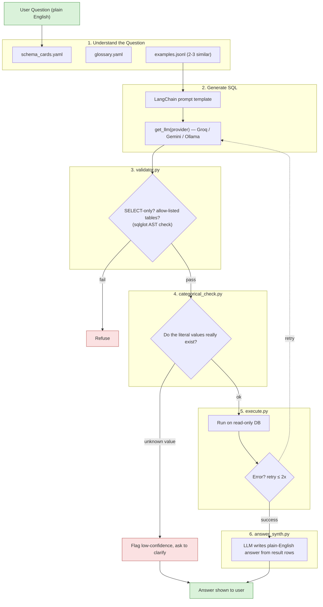

# Flowcharts — Mermaid Source

Same 9 flowcharts as in the Word doc, in raw Mermaid syntax, for pasting into
Obsidian (or any Mermaid-compatible tool). Word can't render Mermaid natively,
so the `.docx` uses rendered images of these same diagrams — this file is the
editable source.

---

## 1. High-Level Pipeline

---

## 2. Block — Understand the Question

## 3. Block — Generate SQL

## 3b. Block — Provider Factory (llm_client.py)

## 4. Block — Validator (validator.py)

## 5. Block — Categorical Check (categorical_check.py)

## 6. Block — Execute + Repair (execute.py)

## 7. Block — Answer Synthesis (answer_synth.py)

---

## 8. Complete Pipeline — All Blocks Combined

---

## 9. Complete Build Roadmap — All Phases

```mermaid
flowchart LR
    P0["Phase 0<br/>Real Data & Database"]
    P1["Phase 1<br/>Semantic Layer"]
    P2["Phase 2<br/>Safety Layer"]
    P3["Phase 3<br/>Value Check"]
    P4["Phase 4<br/>Gold Test Set"]
    P5["Phase 5<br/>Connect Real LLM"]
    P6["Phase 6<br/>Full Agent"]
    P7["Phase 7<br/>Answer Synthesis"]
    P8["Phase 8<br/>Interface"]
    P9["Phase 9<br/>Handoff"]:::good

    P0 --> P1 --> P2 --> P3 --> P4 --> P5 --> P6 --> P7 --> P8 --> P9

    classDef good fill:#D9F2D9,stroke:#3C8A3C
```

