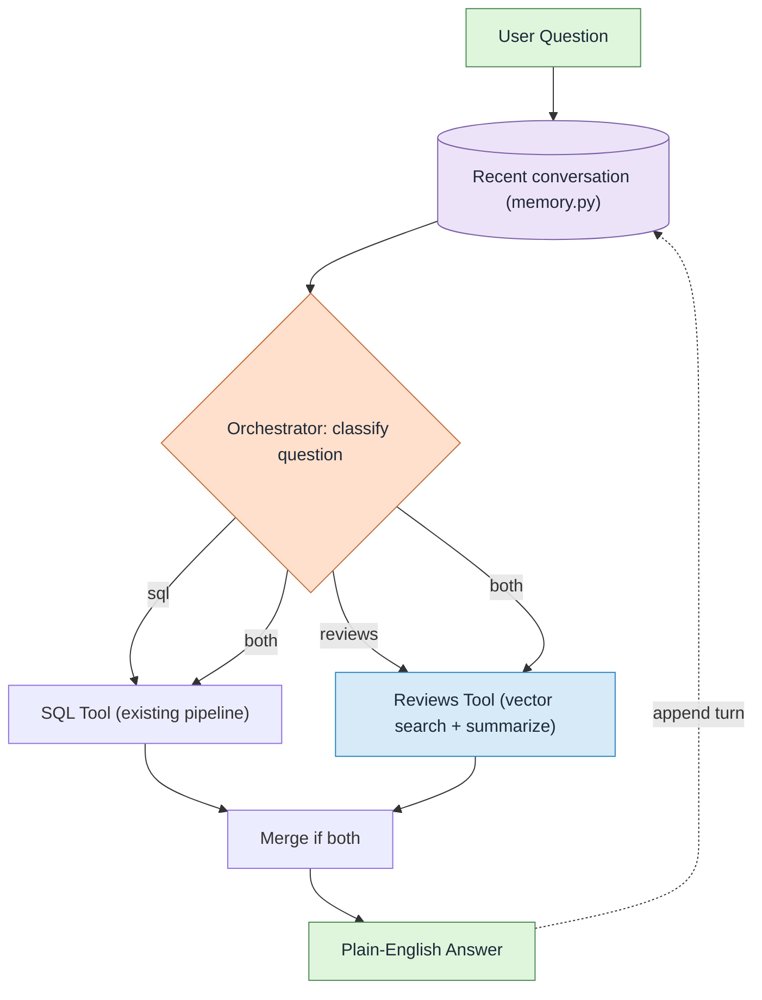
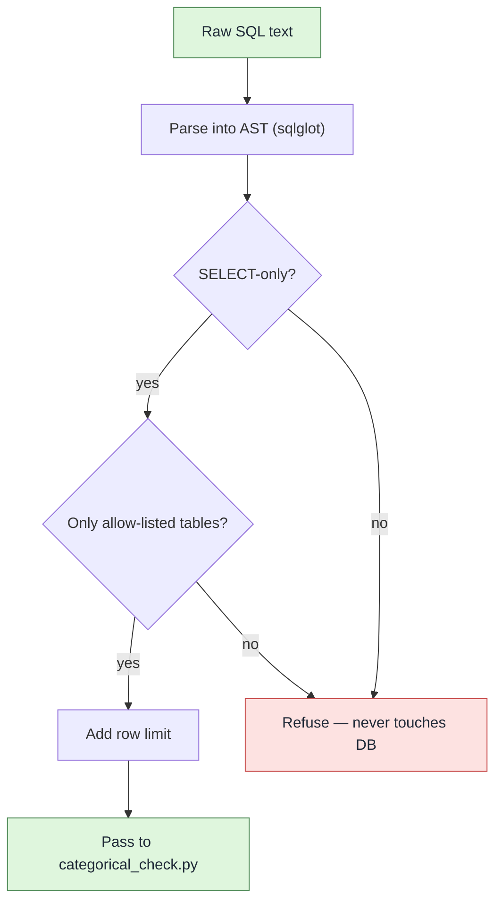
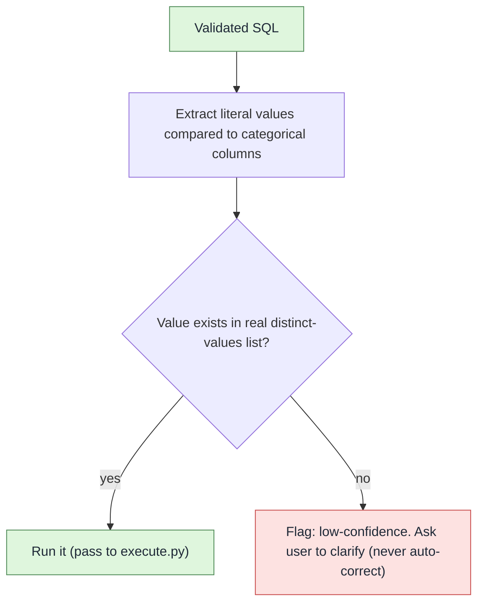
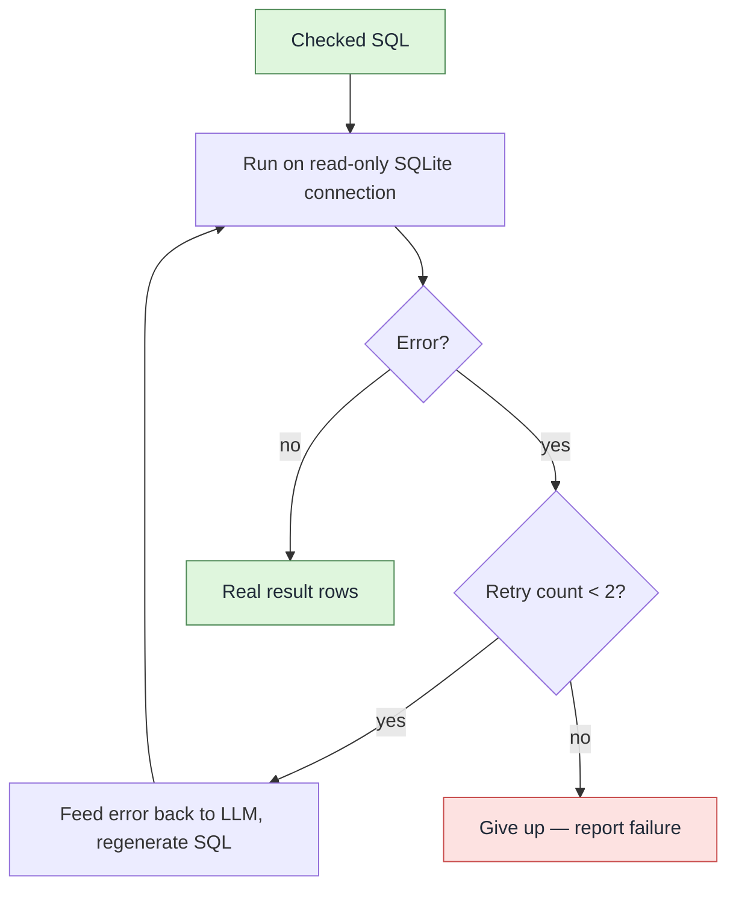
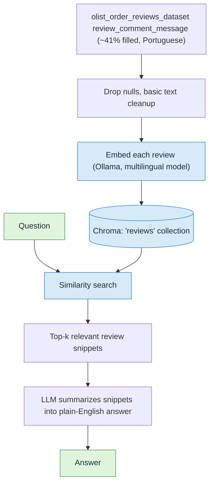
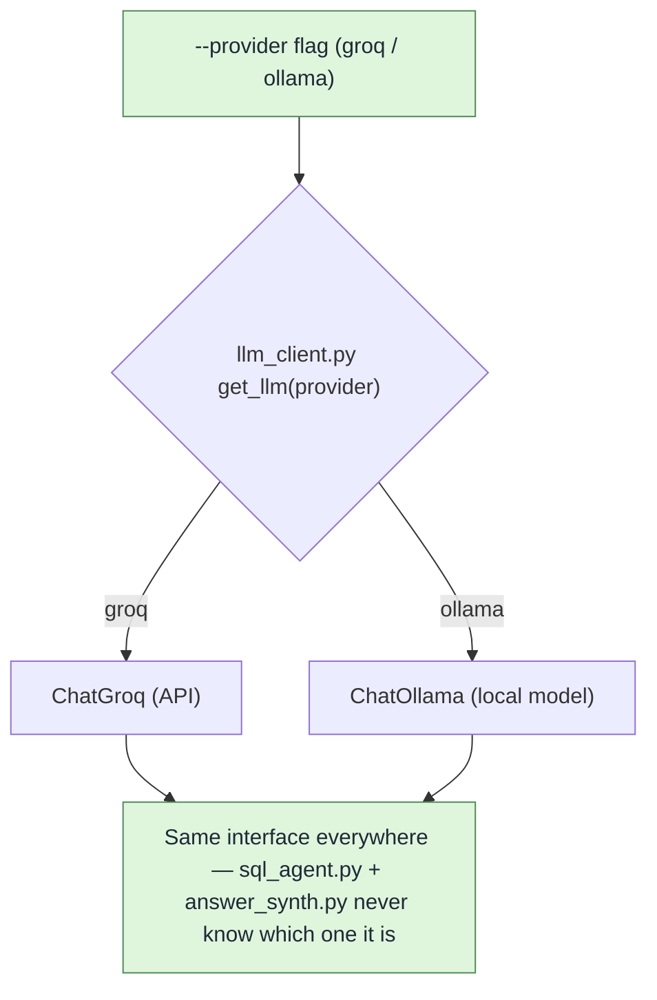

# Logistics & Order Intelligence Chatbot

> A natural-language analytics chatbot that turns plain-English questions into safe, read-only SQL and semantic search over real Brazilian e-commerce data — built brick by brick as a learning project during my internship.

---

## 🔗 Live Links

| Service | URL |
|---|---|
| **Web App** (Vercel) | https://web-six-sooty-14.vercel.app |
| **Backend API** (Railway) | https://olist-logistics-api-production.up.railway.app |
| **Health check** | https://olist-logistics-api-production.up.railway.app/health |

---

## What this is

This chatbot answers questions like:

- *"Which product categories have the highest late-delivery rate?"*
- *"What do customers say about damaged or wrong items?"*
- *"Who are the top sellers by revenue, and how do their reviews look?"*

It works against the real **Olist Brazilian E-Commerce** public dataset — ~100,000 genuine anonymized orders, 2016–2018, 9 relational tables. No synthetic data. No made-up numbers.

**Honest framing:** The dataset is domestic Brazilian e-commerce, not international export data. The analytics questions are export-style (regional breakdowns, delivery delays, payment behavior), but the underlying data is real Brazilian marketplace data. The UI does not pretend otherwise.

---

## Features

- **Dual-route architecture** — automatically classifies each question and routes it to the right pipeline:
  - **SQL route** — structured questions (counts, rankings, averages) → LLM-generated SQL → validated and executed against SQLite
  - **Reviews route** — sentiment questions (complaints, opinions) → semantic vector search over ~41,000 real customer review texts
  - **Both route** — questions that need numbers and customer voice simultaneously
- **Multi-provider LLM** — Groq (cloud, deployed) and local Ollama selectable at runtime; same interface for both
- **Conversation memory** — last 5 turns kept in context; follow-up questions are rewritten to be standalone
- **AST-level SQL validation** — only `SELECT` and CTEs allowed; only 9 allow-listed tables; enforced via `sqlglot` parse tree, not text matching
- **Categorical value checking** — string literals in generated SQL are verified against real distinct values from the database before execution; fuzzy suggestions offered for typos
- **Bounded repair loop** — on execution error, the LLM gets up to 2 retry attempts with the error fed back in
- **Read-only database** — SQLite opened with `uri=True&mode=ro`; physically incapable of writing
- **Never raises** — every pipeline stage has a safety-net `try/except`; a crash returns an error dict, never propagates to the user
- **Web UI** — animated Next.js frontend with a Spline 3D robot, landing-to-chat transition, and live provider selector

---

## Technology Stack

### Backend (Python)
| Layer | Technology |
|---|---|
| API server | FastAPI + Uvicorn |
| LLM providers | LangChain (`langchain-groq`, `langchain-ollama`) |
| SQL validation | `sqlglot` (AST parsing) |
| Database | SQLite (read-only via URI mode) |
| Vector store | Chroma (local file-based) |
| Embeddings | Ollama (`nomic-embed-text`, `qwen3-embedding:0.6b`) |
| Fuzzy matching | Python `difflib` |
| Testing | `pytest` |

### Frontend (Next.js / TypeScript)
| Layer | Technology |
|---|---|
| Framework | Next.js 14 (App Router) |
| Animations | Framer Motion |
| 3D scene | Spline |
| Styling | Tailwind CSS |
| Icons | Lucide React |
| Deployment | Vercel |

### Infrastructure
| Service | Provider |
|---|---|
| Backend hosting | Railway (Docker) |
| Frontend hosting | Vercel |
| LLM inference | Groq API (production), local Ollama (development) |

---

## Architecture & How It Works

The project uses a **deterministic pipeline** — not a black-box autonomous agent. The LLM is used for specific, bounded tasks (classify a question, generate SQL, summarize a result). Every other decision is plain Python `if/else`.

### High-Level Pipeline



### Safety Layer 1 — SQL Validator (`validator.py`)



### Safety Layer 2 — Categorical Check (`categorical_check.py`)



### Execution & Repair Loop (`execute.py`)



### Reviews Tool — RAG over Customer Reviews (`retrieval.py`)



### Provider Factory (`llm_client.py`)



### Build Roadmap — All Phases

```mermaid
flowchart LR
    P0["Phase 0 Real Data and Database"] --> P1["Phase 1 Semantic Layer"]
    P1 --> P2["Phase 2 Safety Layer"]
    P2 --> P3["Phase 3 Value Check"]
    P3 --> P4["Phase 4 Gold Test Set"]
    P4 --> P5["Phase 5 Connect LLM"]
    P5 --> P55a["Phase 5.5a Retrieval and Memory"]:::memory
    P55a --> P55b["Phase 5.5b Reviews Tool and Orchestrator"]:::route
    P55b --> P6["Phase 6 Full Agent"]
    P6 --> P7["Phase 7 Answer Synthesis"]
    P7 --> P8["Phase 8 CLI Interface"]
    P8 --> P9["Phase 9 Web and Deployment"]:::good

    classDef good fill:#DFF6DD,stroke:#4F8A57,color:#1F2937
    classDef memory fill:#EDE3F8,stroke:#7B5EA7,color:#1F2937
    classDef route fill:#FFE0CC,stroke:#C2703D,color:#1F2937
```



---

## How to Run Locally

### Prerequisites

```powershell
# 1. Create and activate a virtual environment
python -m venv venv
.\venv\Scripts\Activate.ps1

# 2. Install Python dependencies
pip install -r requirements.txt

# 3. Create .env file in the repo root
# GROQ_API_KEY=your_key_here

# 4. (Optional, for Ollama mode) Pull the required models
ollama serve
ollama pull qwen2.5:7b
ollama pull nomic-embed-text
ollama pull qwen3-embedding:0.6b
```

### Build the database (first time only)

Download the 9 Olist CSV files from [Kaggle](https://www.kaggle.com/datasets/olistbr/brazilian-ecommerce) to `data/raw/`, then:

```powershell
.\venv\Scripts\python.exe src/build_db.py
```

### Run the backend API

```powershell
.\venv\Scripts\python.exe -m uvicorn src.api:app --reload --port 8000
```

### Run the web app (in a second terminal)

```powershell
Set-Location web
npm install
npm run dev
```

Open `http://localhost:3000`. In local mode, the provider selector shows both **Groq** and **Ollama · Local**.

> **Note:** The deployed Vercel app shows Groq only, because Railway containers cannot reach a local Ollama instance. This is by design and the UI explains it clearly.

### Run tests

```powershell
.\venv\Scripts\pytest -x -q
```

39 tests pass without a network connection. The remaining orchestrator tests require a live Groq API key.

---

## File Structure

```
logistics_chatbot/
├── src/
│   ├── api.py              # FastAPI server — /health, /api/chat, /api/providers
│   ├── orchestrator.py     # Classifies question → dispatches to SQL or Reviews pipeline
│   ├── sql_agent.py        # Full SQL pipeline: generate → validate → check → execute
│   ├── answer_synth.py     # Turns result dict into a plain-English sentence
│   ├── llm_client.py       # Provider factory: Groq / Ollama behind one interface
│   ├── prompt_builder.py   # Assembles LLM prompt from schema cards + examples
│   ├── validator.py        # AST-level SQL safety (sqlglot)
│   ├── categorical_check.py# Checks literal values against real DB values
│   ├── execute.py          # Read-only SQLite runner + repair loop
│   ├── retrieval.py        # Chroma vector store: context + reviews collections
│   ├── memory.py           # Rolling 5-turn conversation buffer
│   ├── build_db.py         # Loads CSVs into olist.db (run once)
│   ├── semantic_loader.py  # Shared YAML/JSONL file loaders
│   └── chat_cli.py         # Interactive terminal loop (local dev / demo)
├── semantic/
│   ├── schema_cards.yaml   # All 9 table schemas with gotchas documented
│   ├── glossary.yaml       # 5 business terms (late_delivery, unique_customer, etc.)
│   ├── examples.jsonl      # 15 hand-written Q→SQL examples + 4 refusal examples
│   └── categorical_values.md  # Ground truth distinct values for 5 categorical columns
├── tests/                  # pytest test suite (normal + adversarial for every module)
├── eval/
│   ├── gold_set.jsonl      # 18 hand-curated end-to-end test cases
│   └── run_eval.py         # Evaluation harness
├── web/                    # Next.js frontend
│   └── src/app/page.tsx    # Main chat UI
├── Flowcharts_Mermaid_Source.md  # Source Mermaid diagrams (editable)
├── Dockerfile              # Railway Docker build
├── requirements.txt
└── .gitignore
```

---

## What's Tested

- **SQL AST validation** — 8 cases including DELETE blocked, DROP blocked, disallowed table blocked, CTE join allowed, multi-statement injection blocked, and a buried subquery attack
- **Read-only enforcement** — test proves sqlite3 itself raises `OperationalError` on an attempted INSERT through the read-only connection
- **Categorical checking** — normal + adversarial: fuzzy suggestions for typos, empty real_set doesn't crash, valid values pass cleanly
- **SQL agent** — gold set of 18 questions through the real pipeline; asserts route correctness, never exact SQL
- **Answer synthesis** — 18 cases: all 4 SQL statuses, review summarization, the `both` route, LLM timeout fallback
- **Conversation memory** — adversarial test caught a real bug: `get_recent_turns()` was returning the internal list object, which could be mutated externally; fixed with `.copy()`
- **Provider propagation** — mocked test proves `provider="groq"` reaches every stage of the orchestration pipeline without real API calls

---

## Deployment Notes

### Provider availability by environment

| Environment | Groq | Ollama |
|---|---|---|
| Local (localhost:3000 + localhost:8000) | ✅ | ✅ (if Ollama is running) |
| Hosted (Vercel + Railway) | ✅ | ❌ (Railway cannot reach a laptop's localhost) |

The frontend reads `/api/providers` on load and shows the Ollama option only when the backend reports it available. When hosted, a note explains this.

### What is not deployed

- `data/chroma_db` (~218 MB) — Railway rejected the upload with `413 Payload Too Large`. The Reviews / RAG search feature works locally but is not available in the deployed version.
- The SQL pipeline works fully in production using a static fallback in `prompt_builder.py` (no Chroma needed for SQL).

---

## The Build Journey

This project was built completely from scratch over about one week, one phase at a time — write, understand, test, commit, repeat. Here is the honest story:

**July 30 — Day 1: Setup**
Empty folder, git init, project brief written. The Olist dataset downloaded and every real column value inspected by hand before writing a single line of logic. Found the first real surprise immediately: `payment_type` has a 5th real value (`not_defined`) that the dataset description did not mention.

**July 31 — The semantic layer and the Python path bug**
Built `schema_cards.yaml` (all 9 tables with gotchas), `glossary.yaml` (5 business terms like "late delivery" and "unique customer"), and 15 hand-written Q→SQL examples. Hit a brutal environment issue: a `Set-Alias` line in the PowerShell profile was silently overriding the venv's Python path on every shell open. Spent most of a session on it before diagnosing and fixing the root cause.

**August 1 — Safety layers**
Built `validator.py` and `execute.py`. First real bug: `find_all(exp.Table)` in sqlglot cannot distinguish a real table from a CTE alias — any query using a CTE was being wrongly blocked. Fixed by subtracting CTE names before the allow-list check. Also confirmed empirically that the read-only SQLite connection physically raises an error on INSERT — not just policy, but OS-enforced.

**August 1 — Categorical check, gold test set, and the LLM**
Built `categorical_check.py`, hand-wrote 18 gold-set test cases covering normal questions, bad categoricals, SQL injection attempts, and unanswerable questions. Then connected the real Groq API for the first time — the LLM correctly pulled `customer_unique_id` (not `customer_id`) from the glossary to avoid overcounting repeat buyers, proving the semantic layer was genuinely being read. Also tested local Ollama (`qwen2.5:7b` on an RTX 4050) — it worked.

**August 2 — RAG, vector store, and memory**
Designed the dual-route architecture: SQL Tool + Reviews Tool + Orchestrator, with conversation memory. Built Chroma collections for both schema context and 40,977 real review comments. Found a real bug in `memory.py` through the first adversarial test ever written on this project: `get_recent_turns()` returned the internal list itself, not a copy — any caller could silently bypass the 5-turn cap. Fixed with `.copy()`. Also confirmed a hard limit in Chroma: even `k == collection_size` crashes SQLite if the collection exceeds ~32,766 entries.

**August 4 — Orchestrator and review pipeline**
Built `orchestrator.py` and tested the full dual-route pipeline end-to-end. The orchestrator makes exactly ONE classification LLM call, then dispatches to fixed pipelines — it is a dispatcher, not an agent, and the no-autonomous-agents rule stays intact. 69/69 tests passing.

**August 5 — Full SQL agent, answer synthesis, CLI**
Built `sql_agent.py` (the full ordered pipeline: generate → refuse detection → validate → check categoricals → execute with repair). The adversarial test caught a real bug: the outer `try/except` only covered the execution step; the LLM generation steps were unprotected. When the Groq daily token limit was hit mid-test-run, `RateLimitError` propagated instead of being caught. Fixed by wrapping the entire function body. 82/82 tests passing. Built `answer_synth.py` and `chat_cli.py`. The project was complete as a CLI tool.

A memorable edge case: during live testing, typing `exit()` instead of `exit` sent the text straight to the LLM as a question. The SQL pipeline refused it (not a valid analytics question), and the reviews route returned a comment mentioning "O fim" (The end). The pipeline never crashed — it just answered a nonsense question gracefully.

**August 5–6 — Web UI and deployment**
The web frontend was built with Next.js + Framer Motion + a Spline 3D robot scene. The backend was containerized with Docker and deployed to Railway. The frontend deployed to Vercel. The live end-to-end test returned `COUNT(*) = 99,441` — the real number of orders in the dataset.

---

## What I Learned

- **AST parsing is the right way to validate SQL** — text matching or regex would always have edge cases. `sqlglot` turns SQL into a parse tree where you can check the structure (is the root node a `SELECT`? are these table names or CTE aliases?) rather than pattern-match strings.
- **Adversarial tests catch bugs that happy-path tests miss** — the memory mutation bug, the unprotected `try/except`, and the Chroma k-limit were all found by deliberately trying to break the code, not by testing the normal path. This rule was added mid-project and immediately paid off.
- **Read-only connections are a real second lock** — `sqlite3` URI mode (`?mode=ro`) tells the OS-level file system to refuse writes, so even if the code were compromised, the database cannot be modified. It is not just a policy — it is enforced at a lower level.
- **CTE aliases look like tables to AST walkers** — `WITH recent_orders AS (SELECT ...)` creates a name that looks like a table to `find_all(exp.Table)`. Without subtracting CTE names, any CTE query would be wrongly blocked by the allow-list validator.
- **"localhost" inside a container is the container, not your laptop** — the most important deployment lesson. Railway containers cannot see `localhost:11434` on the developer's machine. This is not a bug or a config issue — it is how networking works, and the honest solution is to document it clearly rather than pretend the constraint does not exist.
- **LLM calls need the same error handling as network calls** — rate limits, timeouts, and context-length errors all throw exceptions. Every stage that calls the LLM needs a `try/except`, not just the database execution step.
- **Fuzzy matching is genuinely useful for chatbots** — `difflib.get_close_matches` with `cutoff=0.6` correctly suggests the right categorical value for realistic typos, without ever auto-correcting or silently changing the user's query.
- **The difference between a dispatcher and an autonomous agent matters** — an orchestrator that makes one classification call and then runs a fixed pipeline is not an "AI agent" in the sense of something that reasons about its own tool use. Understanding this distinction made the architecture much simpler and the safety guarantees much clearer.

---

## Limitations

- **Chroma index not deployed** — the ~218 MB vector store was rejected by Railway. Review / RAG search is a local-only feature.
- **Ollama not available in production** — Railway containers cannot reach a local Ollama instance. Groq is the only production LLM provider.
- **Single-user session store** — the backend uses an in-memory session dict. This is fine for a demo; it does not survive a server restart and does not support concurrent users at scale.
- **Prompt injection is a known open issue** — a user who types fake prompt headers in their input can pollute the LLM prompt. The SQL validator blocks any real damage (DROP/DELETE are structurally impossible), but the prompt itself can be confused. Documented and deferred.
- **Gemini support is wired but not verified in production** — the free-tier billing requirement made it impractical to test during the internship.
- **SQLite has no `DATEDIFF`** — date arithmetic uses `julianday(a) - julianday(b)`. The LLM needs to be told this explicitly via the glossary, and it was caught twice during development.

---

## Credits & Sources

### Dataset
- **Olist Brazilian E-Commerce Dataset** — https://www.kaggle.com/datasets/olistbr/brazilian-ecommerce

### Libraries and tools that made this possible
- [LangChain](https://python.langchain.com/) — LLM abstraction layer
- [Groq](https://console.groq.com/) — free-tier LLM API (Llama 3.3 70B)
- [Ollama](https://ollama.com/) — local LLM server
- [sqlglot](https://sqlglot.com/) — SQL parser / AST library
- [Chroma](https://www.trychroma.com/) — local vector store
- [FastAPI](https://fastapi.tiangolo.com/) — Python API server
- [Next.js](https://nextjs.org/) — React framework
- [Framer Motion](https://www.framer.com/motion/) — animations
- [Spline](https://spline.design/) — 3D robot scene
- [Railway](https://railway.app/) — backend hosting
- [Vercel](https://vercel.com/) — frontend hosting

### Learning resources
- Andrej Karpathy's videos on understanding how language models actually work — these were the foundation before touching any LangChain API
- The LangChain documentation (read carefully, not just skimmed for copy-paste snippets)
- The sqlglot documentation — the AST structure is not obvious without reading it
- Stack Overflow threads on sqlite3 URI mode, PowerShell profile PATH issues, and Windows venv resolution

### Honest note about the web UI

I will be upfront: **the web frontend was vibe-coded**. I did not write every line of the Next.js UI by hand the way I wrote the Python backend. The backend pipeline — `validator.py`, `execute.py`, `categorical_check.py`, `sql_agent.py`, `orchestrator.py`, `answer_synth.py` — every function, every test, every design decision in those files was written, understood, and tested by me, one piece at a time.

The frontend — the Spline 3D robot, the Framer Motion animations, the glassmorphism UI, the component architecture — was built with significant AI assistance to meet a visual target that would have taken me far longer to hand-code from scratch. I understand what it does and how it connects to the API. I am not claiming I designed every animation property from scratch.

The learning objective of this project was building a safe, deterministic AI pipeline with real data. That part was done brick by brick. The frontend was a way to present it properly without that being the whole point of the project.

---

*Built during an internship project, July–August 2026.*
*Dataset courtesy of [Olist](https://www.olist.com) and André Sionek (Kaggle).*
